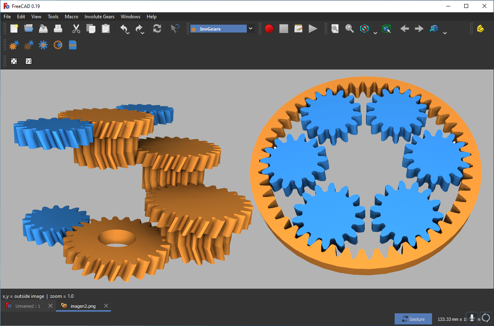

# FreeCAD InvGears workbench

Current version 0.1.0

## Overview

The InvGears workbench allows the creation of gear systems. The gear generation algorithm is based on [[1]](#1).

Given a set of parameters corresponding to a pair of gears, the algorithm finds the geometry of both gears.

It is also possible to create a body with two gears, allowing the creation of cascading gears.
In addition, it is possible to create internal gears.

A very important parameter that was added is an offset for 3D printers. The offset of the gears is calculated analytically, since the derivatives of the geometric equations were obtained to achieve this goal.

On the other hand, it is possible to create gears in an SVG file independently. If you want to create gears in SVG from those already created, this last tool allows you to load the parameters of these gears and then create the SVG file.

InvGears makes use of PartDesign to create bodies in which the gears are located. This allows the gears to be modified using PartDesign.

A small example of how to use the workbench is presented in the following video
https://youtu.be/lxtZ2gQRi88

## Installation

### **LINUX**

**Installing for all users**

Copy InvGears folder into /usr/share/freecad/Mod/

**Installing for a single user**

Copy InvGears folder into /home/username/.FreeCAD/Mod/  where username is your user name

### **Windows**

**Installing for all users**

Copy InvGears folder into C:\Program Files\FreeCAD\Mod\

**Installing for a single user**

Copy InvGears folder into C:\Users\username\Appdata\Roaming\FreeCAD\Mod\ where username is your user name

### **macOs**

### Installing for all users

Copy InvGears folder into /Applications/FreeCAD/Mod/

### Installing for a single user

Copy InvGears folder into /Users/username/Library/Preferences/FreeCAD/Mod/ where username is your user name

## Getting Started

..........

## References
<a id="1">[1]</a> 
Colbourne, John R. The geometry of involute gears. Springer Science & Business Media, 2012.
